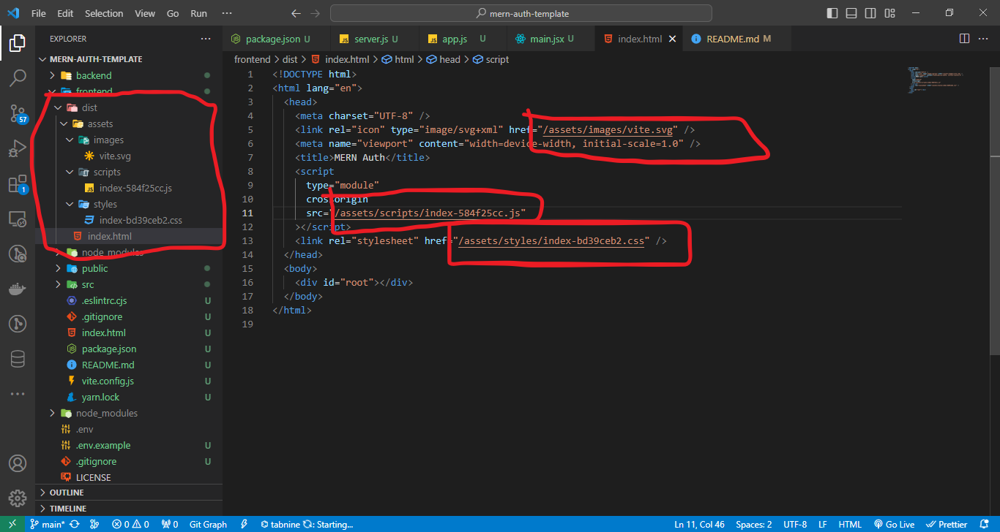

# Mern Basic Auth

A basic full-stack app with React and Express with Authentication using JWT through http-only cookie

**You can watch the tutorial of this application on [Youtube](https://youtu.be/R4AhvYORZRY)**

## Steps to run the application

- Download and install Git from [here](https://git-scm.com/download).
- Download and install Node from [here](https://nodejs.org/en). Install version 18.17.0 or above.
- Download and install MongoDB. Not required if you use MongoDB Atlas or any online instance of MongoDB.
- You may also install MongoDB Compass which provides an UI to interact with MongoDB database.
- Install the package manager. Run the following command on your terminal/powershell:

  ```bash
  npm i -g yarn@1.22.19
  ```

- Clone the Git repository. Run any of the following command on your terminal/powershell:
  - **SSH:**

      ```bash
      git clone git@github.com:Asad13/mern-auth-template.git
      ```

  - **HTTPS:**

      ```bash
      git clone https://github.com/Asad13/mern-auth-template.git
      ```

- Create a .env file at the root directory of the App and create similar variables as mentioned in the .env.example file.
- Create a database in MongoDB for this project. Replace the **{{DATABASE_NAME}}** in .env file with the name of the database.
  
  **Note:** If you use **MongoDB Atlas** or any online instance of MongoDB replace the whole **MONGO_URI** along with the **{{DATABASE_NAME}}** with the appropriate connection string.
- Update **TOKEN_SECRET_KEY** in dotenv file with any string you want. This will be used to create token for authentication which will be stored in a http-only cookie. If you want to use a cryptographically generated random key do the following:

  ```bash
  node
  require('crypto').randomBytes(64).toString('hex')
  ```
  
  Copy the string generated and use it as the value of **TOKEN_SECRET_KEY** in the .env file.
- Open terminal/powershell at the same location as of your application's directory to run rest of the commands.
  
  **Note:** It should be in the root folder. Not in the backend or frontend folder.
- Install all the dependencies. Run the following command on your terminal/powershell:

  ```bash
  yarn install
  ```

- Start the application:
  - In Development Mode(when **NODE_ENV=development** in .env file):

    ```bash
    yarn run dev
    ```

    visit **<http://localhost:3000>** to see your application running.
  - In Production/Staging Mode(when **NODE_ENV=production** or **NODE_ENV=staging** in .env file):
    - First build the frontend:

      ```bash
      cd frontend
      yarn run build
      ```

    **Note:** Vite will build the react app and put it in the **dist** folder. I have changed the original file structure in the **dist** folder according to the image below. For this the file path of the **link** and **script** tags in the **index.html** file should also needs to be changed according to the image.

    

    - Start the application in production:

      **Note:** If you are in the frontend folder in the terminal, move back to the root directory first. Command for moving to root directory from frontend directory is:

       ```bash
      cd ..
      ```

      Then start the application with any of the command below:

      This command below will start the app with **node**. So the running app will not be updated if you change the code(backend only). As the frontend is the built one it will not update either if you update the frontend code.

      ```bash
      yarn start
      ```

      or

      This command below will start the app with **nodemon**. So the running app will be updated if you change the code(backend only). But the frontend will not update if you update the frontend code as it is the built one.

      ```bash
      yarn run dev:server
      ```

      visit **<http://localhost:5000>** to see your application running.
- If you just want to run the backend:

  ```bash
  yarn run dev:server
  ```

- If you just want to run the frontend:

  ```bash
  yarn run dev:client
  ```

- A postman collection is also provided named `mern-auth.postman_collection` which you can import on **Postman** to test the API.
  
  **Note:** You may only run the server or the full application to test the API on Postman.
